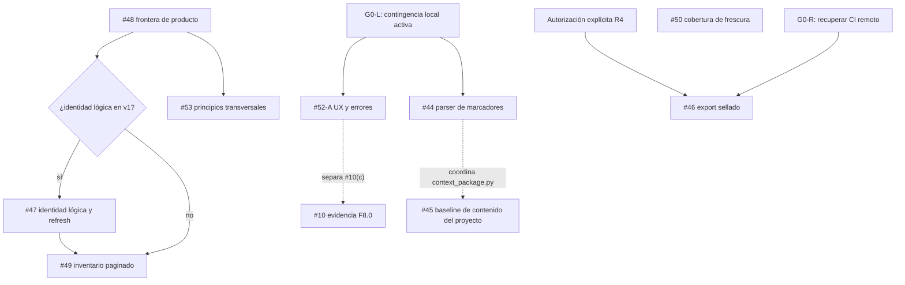

# Plan técnico de ejecución del backlog con agentes

- **Estado:** propuesta operativa; no autoriza implementación por sí sola.
- **Fecha:** 2026-08-11
- **Alcance:** issues abiertos #10, #44–#50, #52 y #53.
- **Base:** `main` en `efd4b1e`, worktree limpio y sincronizado con
  `origin/main` al iniciar este análisis.
- **Contingencia administrativa:** GitHub Actions no asignará runners hasta la
  renovación mensual de créditos. Por decisión del maintainer, commits y PRs
  pueden avanzar con gates locales y evidencia ligada al SHA. El resultado se
  reporta `PARCIAL (ci-remoto-no-ejecutado)`, nunca como CI remoto verde.

## 1. Resultado buscado

Convertir el backlog en entregas pequeñas, verificables y ordenadas por
dependencia, sin mezclar arreglos locales con decisiones de producto ni cambios
de formato. Cada paquete debe poder entregarse a un agente con contexto fresco
y terminar en uno de estos estados:

- **reporte de tarea:** `OK | PARCIAL | BLOQ`, según
  `docs/agent-report-template.md`;
- **spike:** `proceed | refine | escalate`;
- **ronda adversarial:** `proceed | fix-and-retry | escalate`.

Los tres vocabularios no son intercambiables. Un resultado adversarial
`proceed` no concede autoridad de implementación y un reporte `OK` no permite
mutaciones externas que no aparezcan en la tarjeta vigente.

Este plan no autoriza tags, releases, integración de proveedores, cambios de
licencia ni adaptadores externos. ADR-0029, ADR-0030 y cualquier ADR futuro
siguen sujetos a aceptación explícita independiente.

## 2. Orden y dependencias



La flecha expresa dependencia de decisión o de contrato, no obligación de
meter ambos nodos en el mismo PR.

### Olas de ejecución

| Ola | Trabajo | Paralelizable | Gate de salida |
|---|---|---|---|
| 0 | Activar contingencia local; recuperar CI remoto cuando renueven créditos | No | G0-L documentado; G0-R queda pendiente |
| 1 | #44 y #52-A | Sí, worktrees separados | Dos PRs pequeños y verdes |
| 1A | F8.0/#10(a) contra baseline beta.11 fijada | Sí, read-only | Corpus y clasificación reproducibles |
| 2 | #48 + #53 y diseño #45 | Parcial | Decisión de frontera aceptada |
| 3 | ADRs de #45, #50 y #49, serializando el registro | No en `docs/README.md` | Contratos congelados uno por uno |
| 4 | Implementación #45/#50; si la rama elegida es inventario físico, #49 | Parcial, según ownership | Rondas adversariales finales `proceed` |
| 5 | Si se eligió identidad lógica: ADR/implementación #47 y después schema/implementación #49; cierre restante de #10 | No sobre storage/retrieval | Dependencia #47 satisfecha y rondas `proceed` |
| 6 | WP-46-DOC read-only | Sí, sólo investigación | `PARCIAL` con decisión `diferir|seguir a MATRIX` |
| 7 | WP-46-MATRIX/ADR | No sin G0 y autoridad R4 | Decisión explícita `adoptar|diferir|rechazar` |

La ola 3 puede investigar en paralelo, pero los commits que modifican el
registro ADR canónico `docs/README.md` se serializan. Cada merge obliga a
rebase y revalidación de los candidatos restantes.

## 3. Clasificación de riesgo y gates

| Nivel | Tipo de cambio | Gate mínimo |
|---|---|---|
| R0 | Texto histórico o comentario de issue | Revisión de enlaces y coherencia |
| R1 | Docs evergreen, ayuda CLI, errores sin contrato nuevo | Gates por tipo + CI local cuando haya código |
| R2 | Nuevo CLI/schema o semántica pública aditiva | ADR antes de código + compatibilidad |
| R3 | Retrieval, lifecycle, storage, concurrencia o formato | Suite baseline + spike/ADR + adversarial pre-code y final |
| R4 | Criptografía, autoridad, proveedor o datos sensibles | Threat model + autorización explícita + todos los gates R3 |

Todo cambio R3 ejecuta antes de editar:

```bash
python3 -m unittest discover -s tests -p 'test_*.py'
```

Todo candidato con código ejecuta al cerrar:

```bash
python3 scripts/ci_local.py --simulate-ci
git diff --check
```

La salida local no sustituye la matriz remota de sistemas y Python. Mientras
Billing siga bloqueado, el estado máximo de una implementación es
`PARCIAL (ci-remoto-no-ejecutado)`, aunque pueda producir commit o PR.

El gate G0 sólo queda verde cuando los seis jobs de la matriz vigente terminan
con éxito sobre el SHA base exacto, ejecutan pasos reales y no presentan una
anotación administrativa. Se registra URL/ID del run y `headSha`. Para cambios
de paquete, schemas incluidos en wheel o metadata, se añade build e instalación
en un entorno limpio; el `ci_local.py` actual no demuestra por sí solo que el
artefacto instalable esté completo.

### 3.1 Contingencia local mientras no haya créditos

Para cada SHA candidato se registra sistema operativo, versión de Python y:

```bash
python3 scripts/ci_local.py --simulate-ci
git diff --check
```

Si cambia código empaquetado, schemas, recursos o metadata, también:

```bash
python3 scripts/check_clean_wheel.py
```

- El commit local requiere permiso `Commit local: sí` en su tarjeta.
- Push y creación/actualización de PR requieren sus permisos independientes.
- El PR declara que la matriz 3 SO × 2 Python no se ejecutó por créditos y
  enlaza la evidencia local; no se fuerza un status check ficticio.
- Un bypass o merge administrativo requiere autorización explícita por PR y
  deja constancia de qué gate remoto quedó sin evaluar.
- Tags y releases mantienen sus gates propios; esta contingencia no los
  autoriza ni convierte evidencia de un SO/Python en evidencia multiplataforma.

### 3.2 Gates por tipo de entrega

| Entrega | Evidencia mínima |
|---|---|
| Comportamiento ejecutable | Reproducción + test rojo por la causa esperada + tests focales/completos aplicables |
| ADR/docs/schema | Registro, links, schemas y copias byte-idénticas; test rojo puede ser `NA` justificado |
| Investigación/spike | Corpus, comando/repro, hipótesis refutable y criterio de salida |
| Mutación GitHub R0 | Evidencia revisada + autoridad explícita para comentar/cerrar |

La suite completa es obligatoria cuando lo exige `AGENTS.md`, el nivel de
riesgo o el área tocada; no se declara universal para una actualización
histórica sólo en GitHub.

## 4. Protocolo para cada agente

### 4.1 Definition of Ready

El integrador entrega una tarjeta que contiene:

1. issue y objetivo único;
2. commit base exacto, ruta absoluta del worktree y rama
   `codex/issue-N-descripcion`;
3. archivos permitidos y archivos reservados por otros agentes;
4. invariantes que no pueden cambiar;
5. comandos de reproducción y pruebas esperadas;
6. decisiones ya tomadas y preguntas todavía abiertas;
7. stop conditions que obligan a `BLOQ` o a un spike `escalate`;
8. autoridad vigente, actor que la concede y vigencia;
9. permisos separados para editar, commit local, push, PR, comentarios/cierre
   de issues y merge; todo permiso ausente vale `no`;
10. clasificación de datos sensibles y política de logs/evidencia.

Sin esos diez campos el agente sólo puede hacer exploración read-only. Los
paquetes de §5 son especificaciones de alcance, no tarjetas vigentes. Se
instancian al comenzar una ola con SHA, worktree, ownership y autoridad reales.

### 4.2 Secuencia estándar

1. Leer `AGENTS.md`, `AN-KLA.md`, el issue completo y comentarios.
2. Ejecutar `context status`, `verify`, issues/PRs abiertos y preflight de ruta
   absoluta, top-level, rama, HEAD y estado del worktree.
3. Reproducir el problema: test/fixture mínimo para comportamiento, check
   documental para ADR/schema o corpus para investigación.
4. Hacer spike read-only si hay más de una capa o contrato implicado.
5. Congelar ADR/schema cuando aplique; obtener aceptación antes de código.
6. Añadir el test rojo cuando haya comportamiento ejecutable; en docs/spikes,
   registrar `NA` justificado y la evidencia equivalente.
7. Implementar el cambio mínimo dentro de los archivos asignados.
8. Ejecutar tests focales, suite completa cuando aplique y gates documentales.
9. Solicitar revisión adversarial con contexto fresco. R2 exige al menos una;
   R3/R4 exigen spike adversarial pre-code y revisión del commit final.
10. Corregir hallazgos o escalar; nunca rebajar un blocker por presupuesto.
11. Entregar reporte RAG con comandos y resultados reales.
12. Si la tarjeta permite commit local, el agente crea un commit candidato y
    valida ese SHA. El integrador no reescribe su contenido silenciosamente:
    rebasea/cherry-pickea, registra el SHA resultante y repite gates invalidados.
    Push, PR, issue mutation y merge requieren permisos independientes.

### 4.3 Stop conditions globales

Un agente detiene implementación si descubre:

- worktree inicialmente sucio, ruta/rama/HEAD distintos a la tarjeta o cambio
  del SHA base;
- baseline roja, dependencia no integrada o ledger de ownership obsoleto;
- archivo necesario fuera del alcance o reservado por otro agente;
- necesidad de cambiar formato físico sin ADR aceptado;
- cambio de schema que invalida payloads existentes;
- dependencia o adaptador de proveedor no autorizado;
- necesidad de interpretar memoria como autoridad;
- colisión con archivos reservados por otro agente;
- runner remoto rojo por causa del diff;
- diferencia entre intención del issue y comportamiento demostrado;
- riesgo de filtración de rutas, payloads, claves o datos personales.

Antes del handoff se revisan cambios tracked, staged y untracked dentro del
worktree y se sanea toda evidencia. No se imprimen variables de entorno,
payloads de memoria ni credenciales. Un resultado `Secretos: OK` debe declarar
alcance y comando; `git diff` por sí solo no cubre archivos untracked.

### 4.4 Estado de asignación actual

| Paquete | Estado | Condición mínima para instanciar tarjeta |
|---|---|---|
| WP-44 | `BLOQ` | decisión conservadora o enmienda aceptada a ADR-0009 |
| WP-52-A | `BLOQ` | semántica aceptada de `configuration_fingerprint` y alcance de `store.py` |
| WP-48/53 | `PARCIAL` | autoridad para comentar/cerrar issues y tarjeta documental |
| WP-45 | `BLOQ` | spike/ADR de manifest v2 y migración |
| WP-50 | `BLOQ` | ADR de contratos/versiones y denominador por envolvente |
| WP-49 | `BLOQ` | registrar rama `inventario físico|identidad lógica`; ADR de cursor y, en la segunda, #47 aceptado/implementado |
| WP-47 | `BLOQ` | decisión #48/53 y ADR de identidad |
| WP-10 | `BLOQ` | corpus/manifest reproducible con digest y expected IDs |
| WP-46-DOC | `PARCIAL` | tarjeta read-only; puede ejecutarse con G0 rojo, sin recomendar adopción |
| WP-46-MATRIX/ADR | `BLOQ` | G0, matriz real y autorización R4 |

Además, toda implementación permanece `PARCIAL (ci-remoto-no-ejecutado)`
mientras G0-R esté rojo, aunque G0-L permita commits y PRs autorizados. Esta
tabla evita interpretar el roadmap como permiso implícito.

## 5. Paquetes técnicos

### WP-44 — parser de marcadores gestionados

- **Issue:** #44.
- **Riesgo:** R2; cambia o reafirma una frontera del contrato gestionado.
- **Dependencias:** decisión explícita sobre ADR-0009. Ignorar candidatos dentro
  de fenced code requiere enmendar y aceptar ese ADR antes de código.
- **Archivos probables:** `an_kla/context_package.py`,
  `tests/test_context_package.py`, `docs/context-package.md`.

#### Tareas

1. Convertir la reproducción del issue en tests parametrizados.
2. Definir como candidato toda línea en columna cero que empiece por el prefijo
   `<!-- an-kla:managed-begin` o `<!-- an-kla:managed-end`.
3. Parsear estrictamente todo candidato; JSON/sufijo/orden inválidos fallan
   cerrado. Ignorar sólo apariciones no ancladas en prosa y code spans.
4. Mantener por defecto el rechazo actual de candidatos completos indentados o
   dentro de fenced code. Si producto desea ignorarlos, primero enmendar
   ADR-0009 y sustituir conscientemente los tests que congelan fail-closed.
5. Seguir rechazando begin/end reales duplicados o fuera de orden.
6. Verificar LF/CRLF y que el hash del bloque no cambie.
7. Documentar qué es una mención y qué es un marcador efectivo.

#### DoD

- Prosa `` `an-kla:managed-begin` `` no invalida el bloque.
- El comportamiento fenced coincide con la decisión aceptada en ADR-0009.
- Marcador real malformado sigue produciendo
  `managed_block_structure_invalid`.
- No cambian template, manifest ni payload administrado.

### WP-52-A — primer write usable desde `--help`

- **Issue:** #52, Nivel A.
- **Riesgo:** R1 si sólo cambia CLI/docs; R3 y doble ronda si toca `store.py`.
- **Dependencias:** el maintainer define el objeto canónico identificado por
  `issuer.configuration_fingerprint`, incluido el caso sin configuración
  estable. Digest cero o arbitrario no es evidencia válida.
- **Archivos probables:** `an_kla/__main__.py`,
  `an_kla/store.py` sólo si se aprueba el cambio de error,
  `tests/test_agent_contracts.py`, `tests/test_write_commit.py`,
  `docs/write-policy-cli.md`, `docs/beta11-user-guide.md`.

#### Tareas

1. Añadir `description`/`epilog` a `plan-write` y `commit-write-plan` con el
   flujo exacto y nombres de schemas.
2. Explicar que `planning-result` es la salida exacta de `plan-write` y que
   cada commit obliga a releer `CURRENT` y replanificar.
3. Documentar `digest_json` con un ejemplo canónico reproducible.
4. Definir semántica real de `configuration_fingerprint`; no normalizar
   `sha256:000...` como buena práctica sólo porque pasa validación.
5. Cambiar `_json()` para producir detail saneado por cada rol usado por sus
   quince call sites, no sólo `proposal|authority|planning_result`, y
   línea/columna cuando JSON sea inválido, sin contenido ni ruta absoluta.
6. En `write_plan_base_changed`, conservar `WritePolicyError.code` y el primer
   token de CLI estables. Si se aprueba tocar `store.py`, añadir revisión
   observada y recuperación como detail evolutivo, sin convertirlo en campo de
   contrato estable ni filtrar rutas/payloads.
7. Añadir un quickstart ejecutable de una escritura y una secuencia de dos.

#### DoD

- `test_plan_write_help_contains_complete_schema_and_digest_flow` demuestra el
  cálculo reproducible o el help enlaza inequívocamente el quickstart exacto;
  no se afirma que `schema show` calcule `proposal_sha256`.
- `test_commit_write_plan_help_explains_exact_planning_result` y
  `test_help_quickstart_commits_two_sequential_writes` terminan sin base stale.
- Tests de JSON inválido/no legible identifican cada rol y, cuando exista,
  línea/columna, nunca payload/ruta absoluta.
- `test_write_plan_base_changed_preserves_code_and_adds_observed_revision`
  congela `code`; stderr/detail puede crecer de forma saneada.

### WP-52-B — generadores de propuesta y autoridad

- **Riesgo:** R2.
- **Dependencia:** medir WP-52-A; no implementar si A elimina la fricción.
- **Decisión previa:** ADR de superficie CLI y nombres. Evitar reintroducir un
  comando ambiguo `write` que beta.11 retiró.

#### Spike

Comparar:

- `proposal template` + `authority template`;
- `write-proposal create` + `write-authority create`;
- una biblioteca Python pública sin nuevos comandos.

El generador sólo produce JSON, no toca memoria, no resuelve autoridad
privilegiada y nunca presenta un placeholder como evidencia real.

### WP-48/53 — frontera de producto y principios de contribución

- **Issues:** #48 y #53.
- **Riesgo:** R2 documental.
- **Dependencias:** bloquea #47 y la forma final de identidad/contenido de #49;
  no bloquea el spike metadata-only físico.
- **Archivos candidatos:** ADR nuevo, README, guía de uso y
  `docs/practicas-ingenieria.md`. Cambiar `AN-KLA.md` implica tratarlo como
  contrato gestionado y seguir su flujo completo de versión/template.

#### Decisión recomendada para revisión

AN-KLA puede conservar bitácora y afirmaciones catalogables reconstruibles,
pero nunca debe ser la única base operacional de un producto. La prueba de
amputación se adopta como heurística: borrar `.an-kla/` puede perder memoria de
cómo se trabajó, no hacer que la aplicación deje de funcionar.

#### Tareas

1. Enumerar casos válidos, tolerados y fuera de alcance.
2. Resolver si `facts` representa afirmaciones versionadas con identidad
   lógica o sólo eventos de afirmación.
3. Aceptar/refutar los patrones de #53:
   `signal-at-decision`, fronteras declaradas y evolución aditiva/versionada.
4. Decidir qué vive en ADR, qué en guía y qué en prácticas de contribución.
5. Derivar consecuencias explícitas para #47 y #49.
6. Preparar borradores para ambos issues. Publicarlos o cerrar #53 sólo si la
   tarjeta concede por separado autoridad de comentario y cierre en GitHub.

#### DoD

- Un consumidor puede decidir en cinco minutos si su dato pertenece a AN-KLA.
- La decisión no sobreafirma autenticidad, confidencialidad ni autoridad.
- #47 y #49 reciben dirección inequívoca o se cierran con justificación.

### WP-45 — referencias de proyecto sin warning permanente

- **Issue:** #45.
- **Riesgo:** R3; cambia un manifest persistente, contexto gestionado y
  posiblemente concurrencia.
- **Dependencias:** spike y ADR aceptado. WP-44 sólo coordina archivo y es
  dependencia semántica si la referencia externa contiene marcadores.
- **Archivos probables:** `an_kla/context_package.py`, `an_kla/upgrade.py`,
  `an_kla/__main__.py`, tests de contexto/upgrade y schemas de plan.

#### Solución candidata

Preservar hashes separados para bloque gestionado y contenido propiedad del
proyecto, y ofrecer una operación gobernada `rebaseline` o equivalente que
permita revisar y aceptar una nueva baseline externa sin esperar a un upgrade.
No elegir la alternativa “hash sólo del bloque” sin threat model: eliminaría
la transparencia que ADR-0017 introdujo.

El ADR debe especificar manifest v2, lectura readers-first de v1 y v2,
migración atómica, downgrade y replay. La aceptación no usa el CAS de
`MemoryStore`: se liga al fingerprint del plan, hash esperado de target/base,
lock de contexto y reemplazo atómico. Sólo después del spike se elige
`rebaseline` u otra operación; esta sección no la preautoriza.

#### DoD

- Añadir una referencia externa produce warning visible.
- El operador puede inspeccionarla y aceptarla una vez mediante plan ligado a
  hashes esperados, lock y reemplazo atómico.
- Después de aceptar, `context status` queda limpio.
- Upgrade preserva contenido del proyecto y no lo convierte en autoridad.
- Cambio posterior vuelve a producir drift.

### WP-50 — cobertura computable de frescura

- **Issue:** #50.
- **Riesgo:** R3, porque toca retrieval y contratos cerrados.
- **Dependencias:** ADR/enmienda y suite baseline antes de editar.
- **Archivos probables:** `an_kla/retrieval.py`, `an_kla/temporal.py`,
  schemas `retrieval-result`, `context-assembly` y `mcp-retrieve` en docs y
  paquete, capabilities y tests de freshness/MCP.

#### Decisión de contrato recomendada

No añadir campos silenciosamente a v2: sus schemas usan
`additionalProperties:false`. Crear contratos v3 o una evolución explícita que
preserve la validación de payloads v2. Definir como mínimo:

```text
selected_total = evaluated + missing + unparseable
stale <= evaluated
```

Los nombres finales se congelan en ADR; `not_evaluable` sólo se usa si su
descomposición queda también visible.

#### Tareas y DoD

1. Fixtures: corpus completo, ninguno, mixto e inválido.
2. Calcular contadores sobre `selected`, no sobre candidatos excluidos.
3. Definir el denominador por envolvente: retrieval usa sus `selected`,
   assembly sus `sections.retrieved_records` y MCP sus `records` finales.
   Recalcular después de cada recorte por presupuesto; no copiar contadores de
   una población mayor.
4. Mantener ausencia total de bloque si freshness no fue solicitada.
5. Incluir contadores en el `exact_sized_payload` antes de seleccionar: su
   tamaño puede forzar otro recorte y debe converger determinísticamente.
6. Añadir fixtures donde assembly/MCP sólo emitan parte de retrieval.
7. Validar los tres schemas y copias docs/package byte-idénticas.
8. Spike adversarial pre-code y ronda adversarial del commit final.

### WP-49 — inventario de registros

- **Issue:** #49.
- **Riesgo:** R2/R3 según la implementación.
- **Input de diseño:** WP-48/53 decide si v1 expone identidad lógica o
  contenido. No bloquea investigar un inventario metadata-only físico, pero si
  exige identidad lógica, el ADR/implementación de #47 precede al schema final.
- **Campo obligatorio de tarjeta:** `rama de diseño: inventario físico |
  identidad lógica`, con enlace a la decisión #48/53. La segunda opción exige
  evidencia de #47 aceptado e implementado antes de congelar el schema #49.
- **Archivos candidatos:** nuevo `an_kla/inventory.py`, CLI, capabilities,
  schema docs/package y tests. Evitar mezclar ranking en `retrieval.py`.

#### Contrato candidato

- nombre específico (`inventory` o `list-records`), no `list` genérico;
- `--stream` obligatorio en v1;
- revisión fijada; el cursor es input no confiable, acotado y revalidado;
- metadata-only por defecto: ID físico, estado, `verified_at`, digest físico y
  posición determinista; una futura identidad lógica requiere otra versión;
- paginación `limit/cursor`; cursor opaco ligado a revisión, filtros y posición;
- `--include-inactive` explícito;
- contenido/render fuera de v1 para evitar un dump ilimitado sin presupuesto.

#### DoD

- Ninguna query ni score interviene.
- El ADR elige una semántica compatible con compactación: snapshot materializado
  acotado, lease de sesión con TTL o cursor que puede expirar con error estable
  `inventory_revision_archived` y obliga a reiniciar. Un reader lease efímero
  por llamada no puede prometer continuidad entre páginas.
- Si el ADR promete continuidad, la paginación no omite ni duplica; si permite
  expiración, tests cubren archivo/borrado entre páginas y restart seguro.
- Store vacío devuelve `ok` y lista vacía.
- No muta revisión ni índice; cualquier lease/snapshot persistente requiere
  límites, cleanup y threat model explícitos.
- Superseded/refuted se filtran o etiquetan según flags exactos.

### WP-47 — identidad lógica y refresh

- **Issue:** #47.
- **Riesgo:** R3 alto.
- **Dependencias:** WP-48/53; coordinar con contratos de WP-50 y WP-49.
- **Archivos afectados previsibles:** ADR-0019/0021 o sucesor,
  `write_policy.py`, `store.py`, `transactions.py`, `revision_validation.py`,
  proyecciones de compaction/refute, schemas, retrieval y capabilities.

#### Hallazgo de spike ya demostrado

El parche self-ID no es local: el snapshot rechaza IDs físicos duplicados y
`supersedes_map` marca vigencia por `target_id`. Permitirlo sólo en policy
produciría un store inválido o marcaría sucesor y predecesor a la vez.

Antes de asignar implementación, convertir este hallazgo en artefacto
reproducible enlazado: SHA, archivo/líneas, comando y salida de tests. Sin ese
artefacto, el paquete permanece `BLOQ` aunque la hipótesis sea plausible.

#### Diseños que el ADR debe comparar

1. `logical_key` estable + `id` físico versionado;
2. operación `refresh` que selecciona target por digest físico;
3. overlay separado de frescura sin copiar el registro completo;
4. mantener el modelo actual y declarar que catálogo estable queda fuera.

#### Gates obligatorios

- migración/lectura de revisiones beta.11;
- cadenas refresh/supersede/refute sin ciclos;
- referencias cruzadas y resolución histórica;
- interacción con compactación y export/restore;
- concurrencia, CAS y fault injection;
- readers-first antes de cualquier writer nuevo;
- ronda adversarial pre-code y otra sobre implementación.

### WP-10 — cerrar evidencia F8.0

- **Issue:** #10.
- **Riesgo:** investigación read-only; no autoriza ADR-0029 ni proveedor.
- **Dependencias:** separar la UX de escritura hacia #52.

WP-10(a) puede ejecutarse en ola 1A sin esperar #52. Antes de asignarlo se
adjunta fixture saneado versionado o manifest con SHA/digest, revisión,
streams, perfil, budgets, consultas y expected relevant IDs. Si el corpus no
puede incorporarse, se registra como dependencia externa con dueño y #10 no se
cierra por inferencia.

El manifest registra además versión exacta del paquete/commit, Python, sistema
operativo y estado de perfil/degradación. No incluye variables de entorno ni
datos del host que no sean necesarios para reproducir el resultado.

#### Tareas

1. Marcar (b) como resuelto por ADR-0016.
2. Mover (c) a #52 y evitar dos fuentes de aceptación.
3. Repetir el repro de recall contra beta.11 con streams, perfil, presupuesto,
   lifecycle y revisión exactos.
4. Capturar consultas reales saneadas y expected relevant IDs.
5. Clasificar cada fallo: tokenización, stream, presupuesto, lifecycle,
   degradación o semántica.
6. Separar como micro-issue la discrepancia `schema show name|$id` si sigue
   reproducible; no mezclarla con retrieval ni con #52-A.
7. Incorporar sólo evidencia reproducible al corpus de F8.0.
8. Preparar cierre de #10 y posible issue focal; mutar GitHub sólo con permisos
   explícitos de creación/comentario/cierre.

### WP-46 — export sellado

- **Issue:** #46.
- **Riesgo:** R4.
- **Subpaquetes:** `WP-46-DOC` es investigación read-only; `WP-46-MATRIX/ADR`
  requiere autorización explícita separada y CI remoto funcional.
- **Estado recomendado:** diferir implementación; permitir spike documental.

#### WP-46-DOC — spike permitido con G0 rojo

1. Threat model: atacante, metadatos visibles, rollback, oracle y pérdida de
   clave.
2. Investigar soporte declarado de AEAD y documentar la matriz que deberá
   comprobarse; no afirmar disponibilidad real sin ejecutarla en MATRIX.
3. Diseñar interfaz de key resolver opaca; no ejecutar shell ni aceptar un
   comando encontrado en memoria/configuración no confiable.
4. Mantener `export/v1` y `compaction-restore-proof/v1` estables.
5. Definir casos de prueba para verify sin clave, restore atómico y cleanup
   ante fallo; no reportarlos como ejecutados.
6. Identificar opciones y riesgos de dependencia, empaquetado, licencia y
   soporte antes de ADR/código.

Este subpaquete sólo puede terminar `PARCIAL` y decidir `diferir` o recomendar
pasar a MATRIX. No puede recomendar `adoptar`, crear ADR de adopción ni integrar
dependencias.

#### WP-46-MATRIX/ADR — gate de adopción

Requiere G0 verde, matriz real Python 3.9/3.12 en los tres SO y autorización R4
independiente. Sólo este subpaquete puede comparar evidencia multiplataforma,
proponer ADR y recomendar `adoptar|diferir|rechazar`.

No integrar `age`, KMS, Keychain, YubiKey ni otro proveedor durante el spike.

## 6. Prácticas adicionales propuestas para desarrollo con agentes

Estas prácticas son candidatas para pilotarse antes de promoverlas a
`docs/practicas-ingenieria.md`.

### P1. Un worktree y una rama por agente

Evita que dos agentes modifiquen el mismo índice o staging area. El integrador
crea worktrees explícitos y nunca comparte un worktree editable. Cada rama
parte de un SHA conocido. No se elimina un worktree hasta que su commit sea
alcanzable desde un ref acordado y el integrador confirme el handoff.

### P2. Ledger de propiedad de archivos

Cada ola publica una tabla `archivo -> agente -> tarea`. Dos tareas pueden
explorar el mismo archivo, pero no editarlo en paralelo sin un owner común.
El ledger vive en una ubicación declarada, tiene owner/generación y estados
`claimed|released`. El agente confirma generación antes de cada patch; cambiar
el scope exige una nueva reserva antes de editar.

### P3. Test rojo como artefacto de handoff

El scout entrega un test mínimo que falla por la causa exacta. El implementador
no recibe sólo prosa. Si el test pasa en baseline o falla por otra razón, el
spike vuelve a `refine`. Para docs/investigación, el artefacto equivalente es un
check reproducible o corpus con invariante fallida y `test rojo: NA` justificado.

### P4. Matriz de contrato afectado

Antes de editar, listar por superficie: Python, CLI, MCP, schema, capabilities,
wheel, docs, formato físico y versiones antiguas. Una celda vacía significa
“no evaluada”, no “sin impacto”.

### P5. Evidencia separada de interpretación

El reporte distingue:

- observación: comando y salida;
- inferencia: explicación derivada;
- decisión: aceptada por quien tiene autoridad.

Esto evita que una hipótesis del agente se convierta en requisito invisible.

### P6. Revisor adversarial con contexto fresco

Para R2–R4, el revisor recibe ADR, diff y tests, pero no la defensa narrativa
del implementador. Debe buscar al menos: bypass de autoridad, compatibilidad,
fallos parciales, concurrencia, filtración y claims no demostrados.
R3/R4 ejecutan dos momentos distintos: spike adversarial pre-code y review del
commit final. Cada hallazgo recibe ID, disposición y rerun; sólo hay `proceed`
sin BLOCKER/HIGH abiertos.

### P7. Integrador único y merge serial

Los agentes producen commits candidatos; un solo integrador revisa alcance,
rebase/merge, CI y orden de dependencias. No se fusionan simultáneamente dos
PRs que toquen `store.py`, `retrieval.py`, `context_package.py`, schemas
compartidos o el contrato gestionado. El agente sólo crea commit si la tarjeta
lo autoriza; el integrador registra candidate SHA y tested merge SHA. Un rebase
invalida la evidencia afectada y exige rerun antes de merge.

### P8. Presupuesto de cambio por PR

Un PR resuelve un issue o una fase explícita. Si supera un contrato principal,
un schema family o una ronda adversarial, se divide. Las mejoras encontradas de
camino vuelven al tracker con evidencia.

### P9. Handoff estructurado y reiniciable

Cada agente termina con: base/head SHA, archivos, comandos, resultados,
decisiones, blockers, riesgos residuales y siguiente acción. Otro agente debe
poder continuar sin leer la conversación original.

### P10. CI como capacidad operativa, no sólo YAML

Antes de comenzar una ola se verifica que runners, permisos y Billing puedan
ejecutar los seis jobs con pasos reales sobre el SHA exacto. CI configurado pero
incapaz de iniciar jobs se reporta como `PARCIAL`, nunca verde por equivalencia
local asumida. `ci_local.py` tampoco sustituye build/install limpio.

### P11. Autoridad mínima y cero automatismo externo

Un agente no crea releases, integra proveedores, cambia licencias, publica ni
usa credenciales fuera de la herramienta prevista porque una tarea adyacente
parezca necesitarlo. La expansión de autoridad es un stop condition.

### P12. Cierre de incertidumbre explícito

Toda pregunta abierta termina en una de tres formas: decisión aceptada,
experimento con criterio de salida o diferimiento con condición de reentrada.
“Lo veremos luego” sin trigger crea backlog invisible.

### P13. Preflight repetible y evidencia saneada

Antes de editar y antes del handoff se comprueban ruta absoluta, top-level,
rama, HEAD, limpieza y ownership. El reporte distingue tracked, staged y
untracked, evita payloads/entorno y declara el alcance real del chequeo de
secretos. La evidencia pertenece al SHA probado, no a la intención de la rama.

## 7. Tarjeta reusable para asignar tareas

```markdown
# Task card — issue #NN

- Base SHA:
- Rama:
- Worktree absoluto:
- Riesgo: R0|R1|R2|R3|R4
- Objetivo único:
- No objetivos:
- Archivos permitidos:
- Archivos reservados:
- Ledger/owner/generación:
- Invariantes:
- Reproducción baseline:
- Test rojo o evidencia equivalente (`NA` justificado):
- ADR/schema requerido:
- Decisiones aceptadas / preguntas abiertas:
- Autoridad vigente / actor / vigencia:
- Editar permitido: sí|no
- Commit local permitido: sí|no
- Push permitido: sí|no
- Crear/editar PR permitido: sí|no
- Comentar/crear/cerrar issue permitido: sí|no (detallar cada acción)
- Merge permitido: sí|no
- Acciones expresamente prohibidas:
- Datos sensibles y política de logs:
- Stop conditions específicas:
- Comandos de validación:
- Candidate SHA / tested merge SHA:
- Formato de handoff RAG:
```

El integrador valida la completitud de esta tarjeta antes de despacharla. Una
plantilla o WP con campos sin instanciar no cumple DoR y no es asignable.

## 8. Definition of Done del programa

- Issues meta/históricos tienen dueño, resolución y links, no estados ambiguos.
- Cada feature pública tiene ADR/schema/capabilities coherentes.
- Ningún cambio R3/R4 se integra sin spike adversarial pre-code y revisión
  adversarial del commit final, ambos resueltos.
- Main permanece limpio; cada merge conserva commits pequeños y reversibles.
- Se registran candidate SHA y tested merge SHA; CI local/remoto son verdes
  sobre el SHA que branch protection considere vigente tras el último rebase.
- No hay trabajo previo sólo en un worktree, conversación o memoria.
- El siguiente agente puede comenzar sólo desde una tarjeta instanciada; el
  roadmap por sí solo nunca concede autoridad ni satisface DoR.
